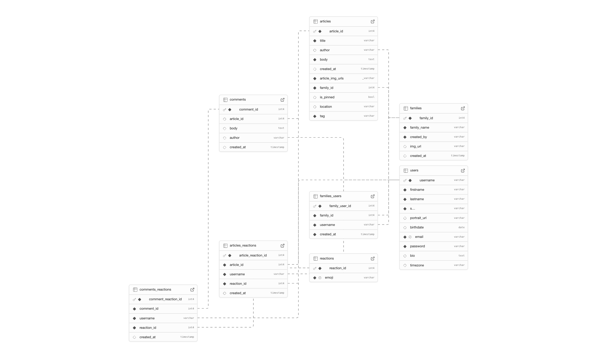

# Kinnect - API

<!-- ## Hosted Version -->

<!-- [Posted - Live Demo](https://kinnect-with.netlify.app) -->

## Project Summary

Moving away from home, especially to a new country, often means we see less of the family and friends who were there for us growing up. This is a common story, particularly when people move abroad for work or study, and it can weaken those important connections.

I know this feeling well. Even though we can use video calls to chat with family, busy lives and big time differences often make it tough to find a good time for everyone. But older relatives are always keen to hear what I'm up to. It's not that I don't care about them; life here just gets busy. Still, I want to share my news and hear theirs, because sharing our happiness with loved ones is important.

Plenty of people don't use social media like Instagram or Facebook, so I created Kinnect. It's a platform just for families to share news, thoughts, and updates. It's a private space where your posts stay within your family, free from judgment, offering love and support from your closest family and friends, no matter how far apart you are.

This repo is a RESTful API that powers Kinnect.

## Table of Contents

- [Setup Instructions](#setup-instructions)
- [Tech Stack & Skills](#tech-stack--skills)
- [API Documentation](#api-documentation) (under progress)
- [Database Schema](#database-schema)

## Setup Instructions

### Prerequisites

- Node.js ( v23.7.0 or higher )
- PostgreSQL ( v14.0 or higher )

### Installation

#### 1. Clone the repository

#### 2. Install dependencies:

```zsh
npm install
```

#### 3. Set up environment variables:

Create two `.env` files in the root directory:

For development:

```
// .env.development
PGDATABASE=kinnect
```

For testing:

```
// .env.test
PGDATABASE=kinnect_test
```

#### 4. Set up and seed the database:

```zsh
npm run setup-dbs
npm run seed-dev
```

### Running Tests

Run the test suite with:

```zsh
npm test
```

### Local Development

To run the server locally:

```zsh
npm start
```

By default, the server will listen on port 9090 (`http://localhost:9090`).

## Tech Stack & Skills

This project demonstrates proficiency in API development, database design, Test-Driven Development, MVC architecture, error handling, and CI/CD implementation.

- **Node.js/Express.js**: RESTful API framework
- **PostgreSQL**: Relational database implementation
- **Jest/Supertest**: Automated testing suite
- **dotenv**: Environment configuration
- **Nodemon**: Development server
- **Husky**: Git hooks integration
- **FakerJs**: Used for generate test and dev dataset

### Skills

1. **Test-Driven Development**: Writing tests before implementing functionality. Tests cover:

- API endpoints
- Edge cases
- Error handling
- Data validation
- Database schema verification

2. **MVC Architecture**: Clear separation of models, views, and controllers
3. **RESTful Design**: Following REST principles for API endpoints
4. **Incremental Development**: Building features incrementally with git version control

## Database Schema



## API Documentation

Once the server is running, you can access the API documentation at the `/api` endpoint, which provides details about all available endpoints, accepted queries, and example responses.

<!-- ### Core Endpoints

| Method | Endpoint                           | Description                             |
| ------ | ---------------------------------- | --------------------------------------- |
| GET    | /api                               | API documentation                       |
| GET    | /api/topics                        | Get all topics                          |
| GET    | /api/articles                      | Get all articles (with filters/sorting) |
| GET    | /api/articles/:article_id          | Get specific article by ID              |
| GET    | /api/articles/:article_id/comments | Get comments for a specific article     |
| POST   | /api/articles/:article_id/comments | Post a new comment to an article        |
| PATCH  | /api/articles/:article_id          | Update article votes                    |
| DELETE | /api/comments/:comment_id          | Delete a comment                        |
| GET    | /api/users                         | Get all users                           |

### Query Examples

**Filtering articles by topic:**

```js
GET /api/articles?topic=coding
```

**Sorting articles:**

```js
GET /api/articles?sort_by=votes&order=DESC
```

**Full example with multiple parameters:**

```js
GET /api/articles?topic=coding&sort_by=created_at&order=ASC
```

For full details and example responses, check the `/api` endpoint. -->
